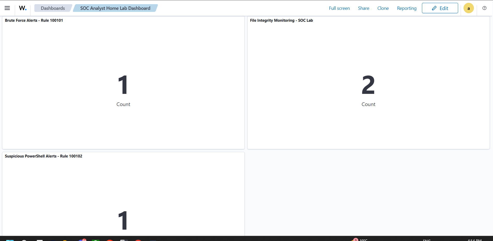
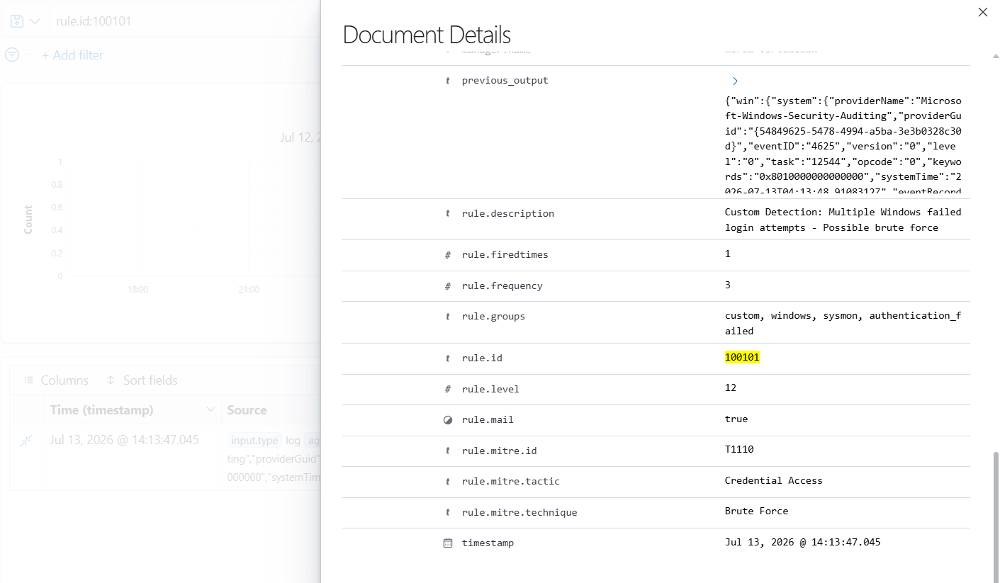
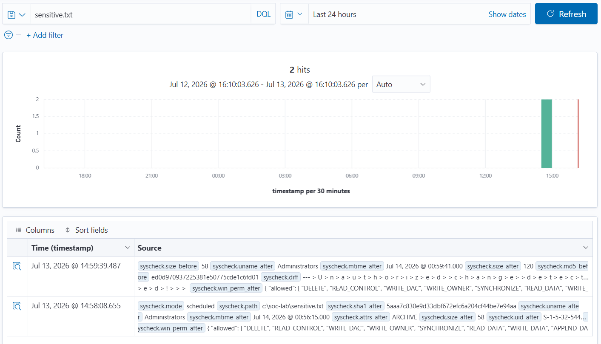
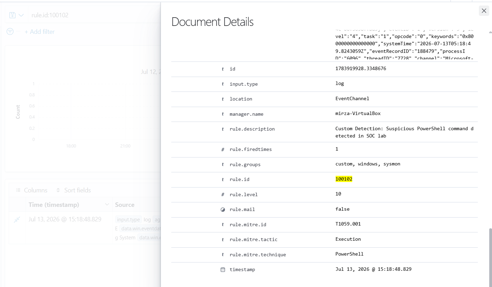

# Wazuh SOC Home Lab

A hands-on Security Operations Center (SOC) home lab built to gain practical experience with SIEM deployment, Windows endpoint monitoring, security event investigation, detection engineering, File Integrity Monitoring (FIM), Sysmon telemetry, MITRE ATT&CK mapping, and SOC dashboard creation.

## Project Overview

This project implements a Wazuh-based SIEM environment consisting of an Ubuntu-based Wazuh server and a monitored Windows endpoint.

The lab was used to:

- Deploy and configure Wazuh SIEM
- Connect and monitor a Windows endpoint
- Collect Windows Event Logs
- Integrate Sysmon telemetry
- Configure File Integrity Monitoring
- Generate controlled security events
- Investigate security telemetry
- Create custom Wazuh detection and correlation rules
- Map detections to MITRE ATT&CK
- Build a custom SOC monitoring dashboard

All testing was performed in a controlled home-lab environment on authorized systems.

---

## Lab Architecture

### Wazuh Server

The Wazuh infrastructure was deployed on an Ubuntu virtual machine and included:

- Wazuh Manager
- Wazuh Indexer
- Wazuh Dashboard
- Filebeat

### Windows Endpoint

The monitored endpoint included:

- Windows operating system
- Wazuh Agent
- Sysmon
- Windows Security Event Logs
- File Integrity Monitoring

### Virtualization and Networking

- Oracle VirtualBox
- Ubuntu virtual machine
- Windows endpoint
- Host-only networking for communication between the endpoint and Wazuh server

### Data Flow

```text
Windows Endpoint
      |
      | Windows Event Logs / Sysmon / FIM
      v
Wazuh Agent
      |
      v
Wazuh Manager
      |
      v
Wazuh Indexer
      |
      v
Wazuh Dashboard
      |
      v
Custom SOC Dashboard
```

---

## Technologies Used

- Wazuh SIEM
- Wazuh Agent
- Wazuh Indexer
- Wazuh Dashboard
- Filebeat
- Sysmon
- Windows Event Logs
- Ubuntu Linux
- Windows
- Oracle VirtualBox
- PowerShell
- XML-based Wazuh custom rules
- MITRE ATT&CK

---

# Detection Scenario 1: Multiple Failed Login Attempts

## Objective

The objective of this scenario was to detect multiple failed Windows authentication attempts and correlate repeated failures into a higher-severity alert representing possible brute-force activity.

## Event Collection

Windows Security Event Logs were collected by the Wazuh Agent and forwarded to the Wazuh Manager.

Failed authentication activity generated Windows Event ID:

```text
4625 - An account failed to log on
```

The events contained information such as:

- Authentication status
- Logon type
- Source IP address
- Authentication package
- Process information
- Failure reason

## Custom Correlation Rule

A custom Wazuh correlation rule was created to identify multiple failed authentication events within a defined time window.

**Custom Rule ID:** `100101`

**Alert Level:** `12`

**MITRE ATT&CK Technique:** `T1110 - Brute Force`

```xml
<rule id="100101" level="12" frequency="3" timeframe="60">
  <if_matched_sid>60122</if_matched_sid>
  <description>
    Custom Detection: Multiple Windows failed login attempts - Possible brute force
  </description>
  <mitre>
    <id>T1110</id>
  </mitre>
</rule>
```

## Investigation

The resulting alert was investigated in Wazuh Discover using:

```text
rule.id:100101
```

The custom rule successfully generated a high-severity alert after the required number of failed authentication events occurred within the configured time window.

## Result

Wazuh successfully:

- Collected Windows failed-login events
- Parsed Windows Event ID 4625 telemetry
- Correlated multiple authentication failures
- Generated a custom Level 12 alert
- Mapped the detection to MITRE ATT&CK T1110

---

# Detection Scenario 2: File Integrity Monitoring

## Objective

The objective of this scenario was to monitor a dedicated directory on the Windows endpoint and detect file creation and modification activity using Wazuh File Integrity Monitoring.

## FIM Configuration

A dedicated test directory was monitored:

```text
C:\SOC-Lab
```

The Wazuh Agent was configured with real-time monitoring and file-content change reporting:

```xml
<syscheck>
  <directories realtime="yes" report_changes="yes">C:\SOC-Lab</directories>
</syscheck>
```

## Test Procedure

A test file named `sensitive.txt` was created inside the monitored directory using PowerShell:

```powershell
"Confidential SOC test data" | Out-File C:\SOC-Lab\sensitive.txt
```

The file was subsequently modified to generate additional File Integrity Monitoring telemetry.

## Investigation

The generated events were investigated in Wazuh Discover by searching for:

```text
sensitive.txt
```

Wazuh successfully provided information including:

- File path
- File size before and after modification
- MD5 hashes
- SHA-1 hashes
- SHA-256 hashes
- File ownership information
- File permissions
- Modification timestamps
- File-content differences through `syscheck.diff`

## Result

Wazuh successfully detected activity involving:

```text
C:\SOC-Lab\sensitive.txt
```

The custom SOC dashboard displayed two FIM events generated during the test.

This scenario demonstrated the ability to configure endpoint file monitoring and investigate changes to monitored files.

## Security Relevance

File Integrity Monitoring can help SOC teams identify unexpected or unauthorized changes to:

- Sensitive files
- Configuration files
- Scripts
- System files
- Application files

FIM provides additional endpoint visibility that can support security investigations and incident response.

---

# Detection Scenario 3: Suspicious PowerShell Execution

## Objective

The objective of this scenario was to use Sysmon process telemetry and a custom Wazuh rule to detect a specific PowerShell command executed in the controlled lab environment.

## Sysmon Integration

Sysmon was configured on the Windows endpoint to provide detailed process telemetry.

The following Sysmon channel was collected:

```text
Microsoft-Windows-Sysmon/Operational
```

Sysmon process creation events provided information including:

- Process image
- Command line
- Process ID
- Parent process
- User
- Integrity level
- File hashes
- Process GUID

## Controlled Test

The following harmless test command was executed:

```powershell
powershell.exe -NoProfile -Command "Write-Output 'SOC-LAB-SUSPICIOUS-POWERSHELL-TEST'"
```

Sysmon captured the PowerShell process creation event and Wazuh processed the telemetry.

The original event was detected by Wazuh Rule `92027`:

```text
Powershell process spawned powershell instance
```

## Custom Detection Rule

A custom rule was created to identify the specific test command.

**Custom Rule ID:** `100102`

**Alert Level:** `10`

**MITRE ATT&CK Technique:** `T1059.001 - PowerShell`

```xml
<rule id="100102" level="10">
  <if_sid>92027</if_sid>
  <field name="win.eventdata.commandLine">
    SOC-LAB-SUSPICIOUS-POWERSHELL-TEST
  </field>
  <description>
    Custom Detection: Suspicious PowerShell command detected in SOC lab
  </description>
  <mitre>
    <id>T1059.001</id>
  </mitre>
</rule>
```

## Investigation

The custom alert was investigated in Wazuh Discover using:

```text
rule.id:100102
```

The alert contained process information from Sysmon, including the PowerShell executable and command-line telemetry.

## Result

The custom rule successfully generated an alert when the matching PowerShell command was observed.

This scenario demonstrated:

- Sysmon integration with Wazuh
- Windows process telemetry collection
- Command-line analysis
- Custom detection engineering
- Wazuh rule development
- MITRE ATT&CK mapping

---

# MITRE ATT&CK Mapping

| Detection Scenario | MITRE Technique | Technique ID |
|---|---|---|
| Multiple Failed Login Attempts | Brute Force | T1110 |
| Suspicious PowerShell Execution | PowerShell | T1059.001 |

---

# Custom SOC Dashboard

A custom dashboard was created to provide centralized visibility into the primary detection scenarios.

The dashboard contains dedicated panels for:

- Brute Force Alerts — Rule `100101`
- File Integrity Monitoring Events
- Suspicious PowerShell Alerts — Rule `100102`

During the documented testing period, the dashboard displayed:

| Detection | Events |
|---|---:|
| Brute Force Alerts | 1 |
| File Integrity Monitoring Events | 2 |
| Suspicious PowerShell Alerts | 1 |

These values represent the controlled test events visible during the selected dashboard time range.

---

# Custom Wazuh Rules

The lab included custom detection and correlation rules.

```xml
<group name="custom,windows,sysmon,authentication_failed,">

  <rule id="100100" level="10">
    <if_sid>92004</if_sid>
    <description>
      Custom Detection: PowerShell spawned Windows Command Prompt
    </description>
    <mitre>
      <id>T1059.003</id>
    </mitre>
  </rule>

  <rule id="100101" level="12" frequency="3" timeframe="60">
    <if_matched_sid>60122</if_matched_sid>
    <description>
      Custom Detection: Multiple Windows failed login attempts - Possible brute force
    </description>
    <mitre>
      <id>T1110</id>
    </mitre>
  </rule>

  <rule id="100102" level="10">
    <if_sid>92027</if_sid>
    <field name="win.eventdata.commandLine">
      SOC-LAB-SUSPICIOUS-POWERSHELL-TEST
    </field>
    <description>
      Custom Detection: Suspicious PowerShell command detected in SOC lab
    </description>
    <mitre>
      <id>T1059.001</id>
    </mitre>
  </rule>

</group>
```

---

# Troubleshooting and Technical Challenges

During the project, several technical issues were investigated and resolved.

## Wazuh Agent Connectivity

The Windows endpoint initially experienced communication issues with the Wazuh Manager.

The virtual networking configuration was adjusted to use a host-only network, allowing reliable communication between the Windows endpoint and Ubuntu Wazuh server.

## Filebeat Authentication

Filebeat initially returned:

```text
401 Unauthorized
```

The Filebeat credentials were corrected and connectivity was verified using:

```bash
sudo filebeat test output
```

Successful output confirmed communication with the Wazuh Indexer:

```text
talk to server... OK
version: 7.10.2
```

## Custom Rule Troubleshooting

The custom rules file initially encountered an XML structure error because Wazuh requires rules to be placed inside a `<group>` root element.

The configuration was corrected and validated using:

```bash
sudo /var/ossec/bin/wazuh-analysisd -t
```

## PowerShell Rule Troubleshooting

The first PowerShell custom rule used an incorrect parent rule ID.

The actual Sysmon alert was investigated in:

```text
/var/ossec/logs/alerts/alerts.json
```

The correct parent rule was identified as:

```text
92027
```

The custom rule was updated and successfully generated Rule `100102`.

---

# Skills Demonstrated

This project demonstrates practical experience with:

- SIEM deployment and administration
- Wazuh configuration
- Windows endpoint monitoring
- Windows Security Event analysis
- Sysmon deployment and telemetry analysis
- File Integrity Monitoring
- Security event investigation
- Log analysis
- Custom detection engineering
- Event correlation
- XML-based Wazuh rule development
- MITRE ATT&CK mapping
- SOC dashboard creation
- Linux administration
- PowerShell
- Virtual networking
- SIEM pipeline troubleshooting

---

# Key Outcomes

By completing this project, I gained hands-on experience building and operating a small SOC monitoring environment.

The project demonstrates the ability to:

1. Deploy a SIEM platform.
2. Connect and monitor a Windows endpoint.
3. Collect Windows and Sysmon security telemetry.
4. Investigate authentication and process events.
5. Configure File Integrity Monitoring.
6. Develop custom detection and correlation rules.
7. Map detections to MITRE ATT&CK.
8. Troubleshoot SIEM ingestion and authentication issues.
9. Build a custom dashboard for security monitoring.

---

# Future Improvements

Future improvements to the lab may include:

- Additional Windows attack simulations
- Encoded PowerShell detection
- Scheduled task persistence detection
- Local account creation monitoring
- Additional Sysmon detection rules
- Email or webhook alerting
- Automated incident-response workflows
- Additional Windows and Linux endpoints
- Expanded SOC dashboards and visualizations

---

# Disclaimer

All security testing and event simulation documented in this project was performed in a controlled home-lab environment on systems owned by or explicitly authorized for testing by the project owner.

This project is intended solely for cybersecurity education, defensive security research, and SOC analyst skill development.

## Screenshots

### SOC Analyst Home Lab Dashboard


### Brute-Force Detection — Custom Rule 100101


### File Integrity Monitoring Detection


### Suspicious PowerShell Detection — Custom Rule 100102

